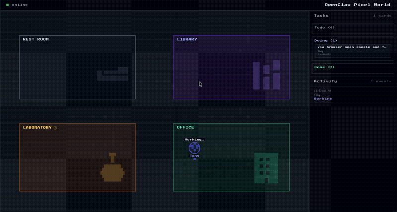
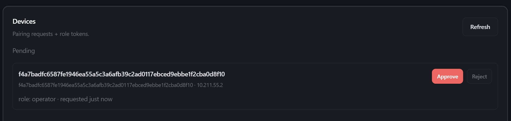

# OpenClaw Pixel World

A real-time WebSocket listener for the OpenClaw Gateway – monitor agent activity, conversations, skill execution, and system events in real-time.



## Features

- 🎯 **Real-time Monitoring** – Track agent responses, conversations, and skill execution instantly
- 🤖 **Multi-Agent Support** – Listen to all connected agents simultaneously  
- 💬 **Conversation Tracking** – See complete chat messages and turns
- ⚙️ **Skill Monitoring** – Watch tool/function calls and their results
- 📊 **Event Streaming** – Receive presence, heartbeat, cron, and health events
- 🔄 **Auto-Reconnect** – Automatically reconnect on connection loss
- 🏗️ **Modular Architecture** – Clean, extensible codebase for your needs
- 🌐 **Browser Dashboard & API** – Built‑in HTTP/Socket.IO server with agent avatars and `/agents` endpoint

## Installation

Requires Node.js 18+.

```bash
git clone https://github.com/yourusername/openclaw-pixel-world.git
cd openclaw-pixel-world
npm install
cp .env.example .env
```

## Connecting to OpenClaw

1. Open your OpenClaw instance → **Settings → Gateway**
2. Copy the WebSocket endpoint and token
3. Set them in `.env`:

```env
OPENCLAW_WS_ENDPOINT=ws://<your-gateway>:18789/?token=<your-token>
```

4. In your OpenClaw config (`openclaw.json`), enable full verbose output:

```json
{
  "agents": {
    "defaults": {
      "verboseDefault": "full"
    }
  }
}
```

Then start the listener:

```bash
npm run serve   # dashboard at http://localhost:3000
```

5. On first connection, approve the listener in the OpenClaw dashboard or via CLI:



## Usage

### Server + Browser Dashboard

The HTTP/Socket.IO server is now built in to the listener binary. Use the
`--serve` flag (or the `serve` script) to enable it:

```bash
npm run serve          # equivalent to `tsx listen.ts --serve`
# or directly
node listen.ts --serve
```

- Dashboard available at `http://localhost:3000`
- API snapshot: `GET /agents` returns JSON array of current agents (populated from WebSocket events and optionally from external API)


### Default Mode (Activity Summary)

```bash
node listen.ts
```

Shows only meaningful bot activity with emoji indicators:

```
🤖 [2026-02-27T21:40:12.000Z] Agent main: Processing user request...
💬 [2026-02-27T21:40:13.000Z] [agent:main:main] USER: What's the weather?
⚙️ [2026-02-27T21:40:14.000Z] Calling weather.get with {...}
⚙️ [2026-02-27T21:40:15.000Z] Skill result: {"temp": 45, "condition": "rain"}
💬 [2026-02-27T21:40:16.000Z] [agent:main:main] ASSISTANT: It's 45°F and raining
```

### JSON Mode (Full Message Dump)

```bash
node listen.ts --json
```

Pretty-prints all raw WebSocket messages for debugging:

```json
[2026-02-27T21:40:13.000Z] message:
{
  "type": "res",
  "id": "connect-xxx",
  "ok": true,
  "payload": {
    "type": "hello-ok",
    "protocol": 3,
    ...
  }
}
```

### With Custom Endpoint

```bash
node listen.ts ws://your-gateway:18789/?token=secret
```

### Disable Auto-Reconnect

```bash
node listen.ts --no-reconnect
```

### Development Mode

```bash
npm run dev              # Watch mode with tsx
npm run dev:json        # Watch mode with JSON output
```

## Environment Variables

| Variable | Description | Default |
|----------|-------------|---------|
| `OPENCLAW_WS_ENDPOINT` | Gateway WebSocket URL | `ws://your-gateway:18789/?token=...` |
| `OPENCLAW_API_ENDPOINT` | HTTP API returning list of agents (merged into /agents) | *none* |
| `LISTENER_JSON` | `true` to log raw messages in server mode | `false` |
| `LISTENER_RECONNECT` | `false` to disable auto-reconnect | `true` |

## Project Structure

```
src/
├── types.ts         # Type definitions for protocol and messages
├── protocol.ts      # Gateway protocol utilities
├── formatter.ts     # Message formatting and activity tracking
├── data.ts          # Data conversion and WebSocket helpers
├── listener.ts      # Main listener implementation (GatewayListener class)
└── cli.ts           # CLI entry point and argument parsing

listen.ts           # Thin wrapper that imports CLI
.env                # Configuration (not in git)
package.json        # Dependencies and scripts
tsconfig.json       # TypeScript configuration
```

## API Reference

### GatewayListener

Main class for connecting to the OpenClaw Gateway.

```typescript
import { GatewayListener } from "./src/listener.js";

const listener = new GatewayListener({
  url: "ws://gateway:18789/?token=xyz",
  json: false,        // Activity summary mode
  reconnect: true     // Auto-reconnect on disconnect
});

await listener.start();
```

### Tracked Event Types

The listener automatically detects and formats these event types:

| Event Type | Description | Emoji |
|------------|-------------|-------|
| `agent` | Agent input/output | 🤖 |
| `chat` | Conversation messages | 💬 |
| `node.invoke.request` / `.result` | Skill execution | ⚙️ |
| `presence` | Agent status changes | 📍 |
| `heartbeat` | Background task execution | 💓 |
| `cron` | Scheduled job execution | ⏰ |

## Contributing

1. Fork the repository
2. Create a feature branch (`git checkout -b feature/amazing-feature`)
3. Commit your changes (`git commit -m 'Add amazing feature'`)
4. Push to the branch (`git push origin feature/amazing-feature`)
5. Open a Pull Request

## License

MIT – See LICENSE file for details

## Support

- 📖 [OpenClaw Documentation](https://github.com/openclaw/openclaw)
- 🐛 [Report Issues](https://github.com/yourusername/openclaw-pixel-world/issues)
- 💬 [Discussions](https://github.com/yourusername/openclaw-pixel-world/discussions)

## Changelog

### v1.0.0 (2026-02-27)
- Initial release
- Real-time WebSocket listener
- Activity summary and JSON debug modes
- Auto-reconnection with exponential backoff
- Modular architecture for extensibility
